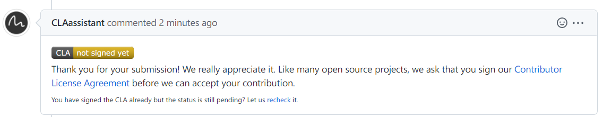
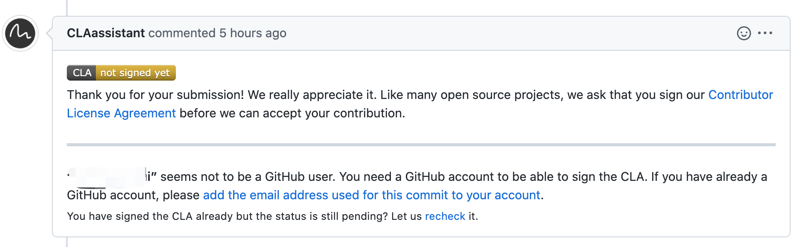
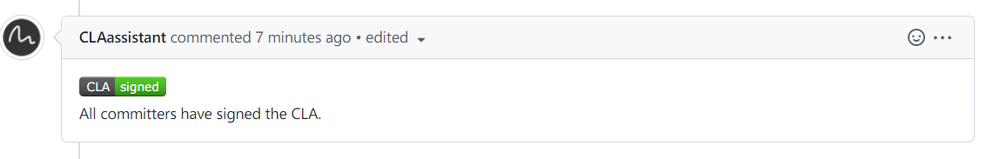

## How do I sign?

After creating your first Pull Request the CLA assistant bot will respond with information regarding your CLA status along with a link to sign the CLA.

> make sure the `git config user.name` same for GitHub name. otherwise will respond to messages like follow

click the **Contributor License Agreement** link to sign CLA.

