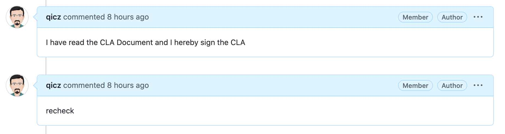
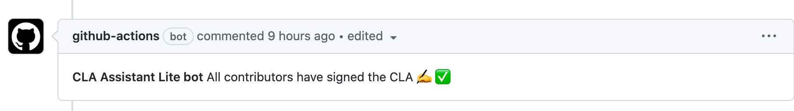

## How do I sign?

After creating your first Pull Request the CLA assistant bot will respond with information regarding your CLA status along with a link to sign the CLA.

> make sure the `git config user.name` same for GitHub name.

reply the message **I have read the CLA Document and I hereby sign the CLA** to sign CLA. and reply the messasge **recheck** to check the sign state

