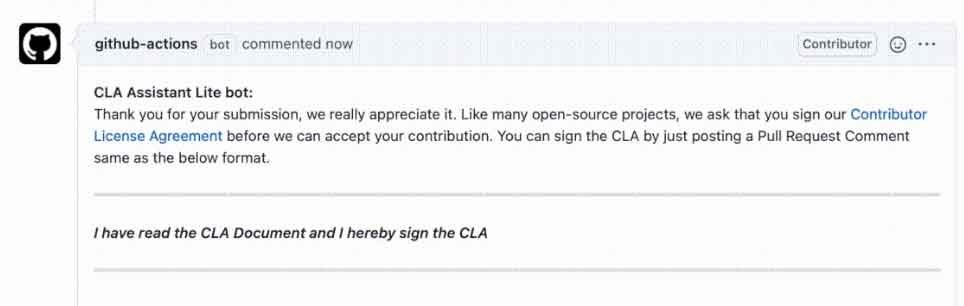
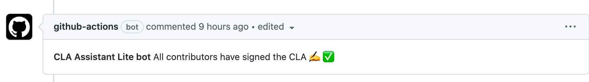

## 如何签署

在创建你的第一个Pull Request之后，CLA（贡献者许可协议 Contributor License Agreement） 助手机器人将响应有关您的 CLA 状态信息以及用于签署 CLA 的链接。

> 确保 `git config user.name` 与 GitHub 的用户名相同。

回复 **I have read the CLA Document and I hereby sign the CLA** 来签署 CLA. 并回复 **recheck** 以检查签名状态。

